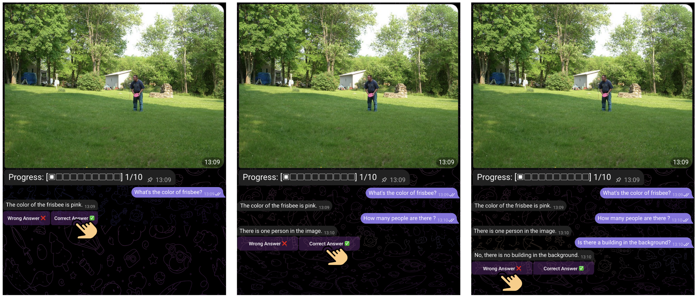

# Gamified Adversarial Prompting (GAP)



**A Framework for Crowd-Sourcing High-Quality Data for Visual Fine-Tuning**

Join our [💬 Telegram](https://t.me/Fraction_AI)

GAP-VQA Dataset [🤗](https://huggingface.co/datasets/fractionai/GAP-VQA-Dataset) | MiniCPM-Llama3-V-2.5-8B fine-tuned on GAP [🤗](https://huggingface.co/openbmb/MiniCPM-Llama3-V-2_5-GAP) | [GAP Technical Report](https://arxiv.org/abs/XXXX.XXXXX)

## News

* [2024.09.16] 🚀🚀🚀 We open-source the GAP-VQA dataset and fine-tuned models! Try them now on Hugging Face!
* [2024.09.10] Our paper "Gamified Adversarial Prompting (GAP) - A Framework for Crowd-Sourcing High-Quality Data for Visual Fine-Tuning" is now available on arXiv.
* [2024.08.15] We've reached over 50,000 participants in our GAP platform!

## Table of Contents

1. [Introduction](#introduction)
   - [Key Features](#key-features)
   - [The Game](#the-game)
2. [Results and Achievements](#results-and-achievements)
   - [Model Performance on GAP-VQA-val Dataset](#model-performance-on-gap-vqa-val-dataset)
   - [Cross-Dataset Evaluation](#cross-dataset-evaluation)
   - [Cross-Model Evaluation](#cross-model-evaluation)
3. [User Participation](#user-participation)
4. [Usage and Implementation](#usage-and-implementation)
5. [Future Work](#future-work)
6. [Contributing and Community](#contributing-and-community)
7. [License and Citation](#license-and-citation)

## Introduction

Gamified Adversarial Prompting (GAP) is a groundbreaking framework that revolutionizes the collection of high-quality data for visual instruction tuning of large multimodal models. By transforming data collection into an engaging game, GAP motivates participants to uncover and challenge the limitations of AI models, leading to unprecedented improvements in model performance.

### Key Features

- 🎮 **Gamified Data Collection**: An immersive platform where participants earn rewards by identifying AI model weaknesses.
- 🚀 **Highly Scalable Framework**: Rapidly engaged over 50,000 participants within weeks, demonstrating exceptional growth potential.
- 📈 **Dramatic Model Improvements**: Achieved a remarkable increase in GPT score for MiniCPM-Llama3-V-2.5-8B from 0.147 to 0.477.
- 🌐 **Universal Cross-Model Benefits**: Demonstrated significant improvements across various model architectures, indicating broad applicability.
- 🔗 **Cutting-edge Web3 Integration**: Leveraging blockchain technology for transparent rewards and true contributor ownership.

### The Game

At the heart of our framework is an engaging game that challenges players to outsmart AI models:

1. Players are presented with a series of images, each for a maximum of 120 seconds.
2. For each image, the player's goal is to formulate a question that the AI model will answer incorrectly.
3. Players can ask multiple questions per image, strategically probing for model weaknesses.
4. Points are awarded based on the player's ability to identify questions that reveal gaps in the AI's knowledge.
5. The game includes both "tainted" (simple) and "untainted" (complex) images, creating a varied and challenging experience.

This gamified approach not only makes data collection enjoyable but also naturally guides players towards uncovering genuine model limitations, resulting in an exceptionally high-quality dataset.

## Results and Achievements

Our GAP framework has produced remarkable improvements across multiple models and datasets, showcasing its power and versatility:

### Model Performance on GAP-VQA-val Dataset

| Model | Pre-fine-tuning GPT Score | Post-fine-tuning GPT Score | Improvement |
|-------|---------------------------|----------------------------|-------------|
| GPT-4V (Benchmark) | **0.637** | - | - |
| MiniCPM-Llama3-V-2.5-8B | 0.147 | **0.477** | **+0.300** |
| Qwen2-VL-2B | 0.169 | 0.285 | +0.116 |
| Qwen2-VL-7B | 0.207 | 0.250 | +0.043 |

The fine-tuned MiniCPM-Llama3-V-2.5-8B model achieved a remarkable 324% improvement, dramatically closing the gap with the GPT-4V benchmark. This extraordinary leap in performance demonstrates the exceptional quality of the GAP-VQA dataset.

### Cross-Dataset Evaluation

Performance of MiniCPM-Llama3-V-2.5-8B before and after fine-tuning on GAP-VQA:

| Dataset | Pre-fine-tuning | Post-fine-tuning |
|---------|-----------------|------------------|
| LLaVA Bench | **87.9** | 82.2 |
| OCRBench | 72.4 | **73.1** |
| MME | 2025.61 | **2040.54** |
| RealWorldQA | **0.634** | 0.609 |
| MM-Vet | 51.422 | **51.789** |
| MMBench | **0.752** | 0.7422 |
| HallusionBench | 59.93 | **60.25** |
| TextVQA | 76.63 | **76.966** |
| MMMU val | 0.474 | **0.486** |
| DocVQA | **84.47** | 84.33 |

The GAP-fine-tuned model shows impressive gains across a wide range of benchmarks, highlighting the framework's ability to enhance general visual understanding and reasoning capabilities.

### Cross-Model Evaluation

Performance of Qwen2-VL-7B before and after fine-tuning on GAP-VQA:

| Dataset | Pre-fine-tuning | Post-fine-tuning |
|---------|-----------------|------------------|
| LLaVA Bench | 76.7 | **83.6** |
| OCRBench | 86.1 | **86.7** |
| MME | 2318.98 | **2332.71** |
| RealWorldQA | **0.699** | 0.690 |
| MM-Vet | 62.889 | **64.954** |
| MMBench | 0.808 | **0.815** |
| HallusionBench | **68.769** | **68.769** |
| TextVQA | **84.428** | 84.084 |
| MMMU val | 0.524 | **0.527** |
| DocVQA | 93.866 | **94.038** |

Performance of Qwen2-VL-2B before and after fine-tuning on GAP-VQA:

| Dataset | Pre-fine-tuning | Post-fine-tuning |
|---------|-----------------|------------------|
| LLaVA Bench | 52.6 | **57.9** |
| OCRBench | 81.2 | **81.4** |
| MME | 1881.92 | **1962.75** |
| RealWorldQA | **0.626** | 0.6156 |
| MM-Vet | 51.146 | **52.43** |
| MMBench | 0.729 | **0.732** |
| HallusionBench | 61.619 | **62.99** |
| TextVQA | 79.824 | **80.074** |
| MMMU val | 0.414 | **0.448** |
| DocVQA | 89.26 | **89.36** |

These results demonstrate the remarkable versatility of the GAP framework. Not only does it dramatically improve the performance of the model it was initially designed for (MiniCPM-Llama3-V-2.5-8B), but it also yields significant enhancements in different model architectures and sizes. This cross-model benefit is a testament to the high quality and broad applicability of the GAP-VQA dataset.

## User Participation

The GAP framework has achieved outstanding user engagement, showcasing its appeal and effectiveness:

### Weekly Session Participation

```
69.68% | ■■■■■■■■■■■■■■■■■■■■■■■■■■■■■■■■■■■■■■■■ | 0 sessions
27.75% | ■■■■■■■■■■■■■■                           | 1 session
 2.68% | ■                                        | 2+ sessions
```

Our participation data reveals a highly engaged user base:

- An impressive 30.32% of users actively participate at least once per week, demonstrating strong interest in the platform.
- A dedicated core of 2.68% of users show exceptional engagement by participating in multiple sessions weekly.
- The substantial 27.75% of users who engage in one session per week represent a large pool of casual participants, indicating the game's broad appeal.

### Images Interacted Per Session

```
 0.6 |                                        ■
     |                                        ■
 0.5 |                                        ■
     |                                        ■
 0.4 |                                        ■
     |                                        ■
 0.3 |                                        ■
     |                                        ■
 0.2 |                                        ■
     |                    ■                   ■
 0.1 |    ■   ■   ■   ■   ■   ■   ■   ■   ■   ■
     |    ■   ■   ■   ■   ■   ■   ■   ■   ■   ■
   0 |____■___■___■___■___■___■___■___■___■___■___
          1   2   3   4   5   6   7   8   9   10
                 Number of Images
```

This graph showcases the exceptional engagement level of our participants:

- The striking peak at 10 images demonstrates that the vast majority of active users complete entire sessions, indicating high levels of engagement and satisfaction with the game design.
- The consistent interaction across 1-9 images suggests that even users who don't complete full sessions still provide valuable data, contributing to the richness of our dataset.

These participation patterns highlight the GAP framework's success in creating an addictive and rewarding experience that motivates users to contribute high-quality data consistently.

[The rest of the README remains the same as in the previous version]

## Usage and Implementation

### Installation

```bash
git clone https://github.com/fraction-ai/GAP.git
```

### Example Usage

```python
from peft import PeftModel
from transformers import AutoModel

# Define model type and path to the adapter
model_type = "openbmb/MiniCPM-Llama3-V-2.5"
path_to_adapter = "path_to_lora_checkpoint"

# Load the base pre-trained model
model = AutoModel.from_pretrained(
    model_type,
    trust_remote_code=True
)

# Load the LoRA adapter and move model to GPU
lora_model = PeftModel.from_pretrained(
    model,
    path_to_adapter,
    device_map="auto",
    trust_remote_code=True
).eval().cuda()

# Your code here
```

### Dataset

The GAP-VQA dataset (3,683 question-image pairs) is available on [Hugging Face](https://huggingface.co/datasets/fractionai/GAP-VQA-Dataset).

### Fine-tuning and Evaluation

LoRA fine-tuning scripts have been set up for [MiniCPM-Llama3-V-2_5](https://github.com/fraction-ai/GAP/tree/main/finetune/MiniCPM-Llama3-V-2.5) and [Qwen2-VL](https://github.com/fraction-ai/GAP/tree/main/finetune/Qwen2-VL/LLaMA-Factory). Detailed instructions can be found inside each link.

Instructions for Benchmark Evaluation of LoRA fine-tuned models are present in [VLMEvalkit](https://github.com/fraction-ai/GAP/tree/main/evaluate/VLMEvalKit). You can also check out [GPT-4V Score](https://github.com/fraction-ai/GAP/tree/main/evaluate/gpt_score) calculation to compute the GPT scores for these models. 

## Future Work

Our future work will focus on enhancing the GAP framework through three key developments:

1. **AI-Assisted Question Generation**: We plan to develop a visually fine-tuned language model capable of generating questions that the base LLM answers incorrectly. This will allow for more systematic identification of model blind spots and weaknesses.

2. **Advanced Probabilistic Modeling**: We aim to create a sophisticated probabilistic model that incorporates factors such as player skill, image difficulty, response time, and fatigue. This will enable more accurate estimation of LMM capabilities while controlling for confounding variables.

3. **Expanding GAP's Applicability**: We will explore the application of the GAP framework beyond LMMs to other AI domains. This expansion will involve addressing domain-specific challenges and ethical considerations unique to each field.

These advancements aim to create a more scalable, efficient, and widely applicable approach for continuous improvement of AI systems through targeted human feedback.

## Contributing and Community

We welcome contributions! See our [CONTRIBUTING.md](CONTRIBUTING.md) for details. Join our [Telegram](https://t.me/Fraction_AI) for discussions, follow us on [Twitter](https://x.com/FractionAI_xyz) for updates, and check our [Blog](https://medium.com/@fractionai) for in-depth content.

## License and Citation

This project is licensed under the Apache 2.0 License. If you find our work helpful, please cite our paper:

```bibtex
@article{gap2024,
  title={Gamified Adversarial Prompting (GAP) - A Framework for Crowd-Sourcing High-Quality Data for Visual Fine-Tuning},
  author={Shashank Yadav, Rohan Tomar, Garvit Jain, Chirag Ahooja, Shubham Chaudhary, Charles Elkan},
  journal={arXiv preprint arXiv:XXXX.XXXXX},
  year={2024}
}
```
